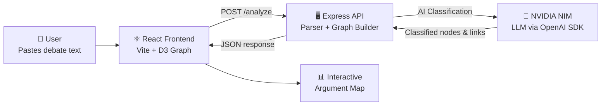

<div align="center">

# ⚔️ Argument Replay Engine

**AI-powered debate analysis that turns noisy discussion threads into animated claim maps, relationship summaries, and report-ready insight panels.**

[](https://github.com/sudharshan994/argument-analysis/actions/workflows/ci.yml)
[](LICENSE)
[](https://react.dev)
[](https://expressjs.com)
[](https://d3js.org)
[](https://build.nvidia.com)

</div>

---

## 📋 Table of Contents

- [Why It Matters](#-why-it-matters)
- [Key Features](#-key-features)
- [Architecture](#-architecture)
- [Tech Stack](#-tech-stack)
- [Project Structure](#-project-structure)
- [Getting Started](#-getting-started)
- [API Reference](#-api-reference)
- [Deployment](#-deployment)
- [Quality Checks](#-quality-checks)
- [Contributing](#-contributing)
- [License](#-license)

---

## 🎯 Why It Matters

Online debates are usually hard to review because claims, counterclaims, questions, and repeated points are mixed together. **Argument Replay Engine** parses a pasted thread, extracts the logical propositions, groups duplicate claims, and replays the conversation as an interactive graph.

This project demonstrates **full-stack engineering** with **AI integration**: React frontend, Express backend, NLP-based classification, and D3 graph visualization — all tied together with CI/CD.

---

## ✨ Key Features

| Feature | Description |
|---------|-------------|
| 🧠 **AI Classification** | Classifies comments into claims, counterclaims, agreements, questions, tangents, and insults |
| 🔗 **Deduplication** | Groups similar propositions into cleaner canonical claims |
| 📊 **Interactive Graph** | Animated D3 force-directed graph with support, attack, question, and restatement links |
| 💡 **Insight Panel** | Surfaces most contested claim, most supported claim, relationship counts, and confidence scores |
| 🔒 **Env-based Config** | Payment details and API keys configured through environment variables |
| ⚡ **CI/CD Pipeline** | GitHub Actions workflow for linting, building, and syntax checking |

---

## 🏗️ Architecture



---

## 🛠️ Tech Stack

| Layer | Technology |
|-------|------------|
| **Frontend** | React 19, Vite 8, D3.js 7, TailwindCSS 4 |
| **Backend** | Express 5, Node.js |
| **AI/ML** | NVIDIA NIM (via OpenAI-compatible SDK) |
| **Code Quality** | ESLint 10 |
| **CI/CD** | GitHub Actions |
| **HTTP Client** | Axios |

---

## 📁 Project Structure

```
.
├── src/                       # React frontend
│   ├── App.jsx                # Main application component
│   ├── components/
│   │   ├── GraphCanvas.jsx    # D3 force-directed graph renderer
│   │   └── InsightPanel.jsx   # AI-generated insight cards
│   ├── App.css                # Application styles
│   └── index.css              # Global styles
├── server/                    # Express API server
│   ├── index.js               # Server entry point & routes
│   ├── nvidia.js              # NVIDIA NIM AI integration
│   ├── graph.js               # Graph construction logic
│   └── parser.js              # Debate text parser
├── public/                    # Static assets
├── .github/workflows/ci.yml   # CI pipeline
├── .env.example               # Environment variable template
└── package.json               # Dependencies & scripts
```

---

## 🚀 Getting Started

### Prerequisites

- Node.js 18+ and npm
- NVIDIA NIM API key ([get one here](https://build.nvidia.com))

### 1. Clone the repository

```bash
git clone https://github.com/sudharshan994/argument-analysis.git
cd argument-analysis
```

### 2. Configure environment

```bash
cp .env.example .env
# Edit .env and add your NVIDIA_API_KEY
```

| Variable | Description |
|----------|-------------|
| `NVIDIA_API_KEY` | Your NVIDIA NIM API key |
| `VITE_API_URL` | Backend URL (default: `http://localhost:3001`) |
| `VITE_PAYMENT_ADDRESS` | Payment identifier |
| `VITE_PAYMENT_NAME` | Payment display name |

### 3. Start the frontend

```bash
npm install
npm run dev
```

### 4. Start the backend (separate terminal)

```bash
cd server
npm install
npm run dev
```

The frontend runs at `http://127.0.0.1:5173` and the API at `http://localhost:3001`.

> **Note:** On Windows PowerShell, use `npm.cmd` instead of `npm` if script execution policy blocks `npm.ps1`.

---

## 📡 API Reference

### `POST /analyze`

Analyze a debate thread and return an argument graph.

**Request:**
```json
{
  "rawText": "Alice: Claim text\nBob: Response text"
}
```

**Response:**
```json
{
  "nodes": [
    { "id": "1", "label": "Claim text", "type": "claim", "speaker": "Alice" }
  ],
  "links": [
    { "source": "2", "target": "1", "type": "attack" }
  ],
  "meta": {
    "comments": 2,
    "classified": 2,
    "relationships": 1,
    "confidence": 0.85
  }
}
```

### `GET /health`

Returns API status and timestamp.

---

## 🚢 Deployment

```bash
npm run build
```

- Deploy `dist/` to a static host (Vercel, Netlify, Cloudflare Pages)
- Deploy `server/` to a Node.js host (Railway, Render, Fly.io)
- Set environment variables in both environments

---

## ✅ Quality Checks

```bash
npm run lint     # ESLint code quality
npm run build    # Production build verification
```

The CI workflow runs lint, production build, server dependency install, and server syntax check on every push or PR to `main`.

---

## 🤝 Contributing

Contributions are welcome! Please see [CONTRIBUTING.md](CONTRIBUTING.md) for guidelines.

---

## 📄 License

This project is licensed under the MIT License — see the [LICENSE](LICENSE) file for details.

---

<div align="center">

**Built with ❤️ by [Vellore Venkateshan Sudharshan](https://github.com/sudharshan994)**

</div>
